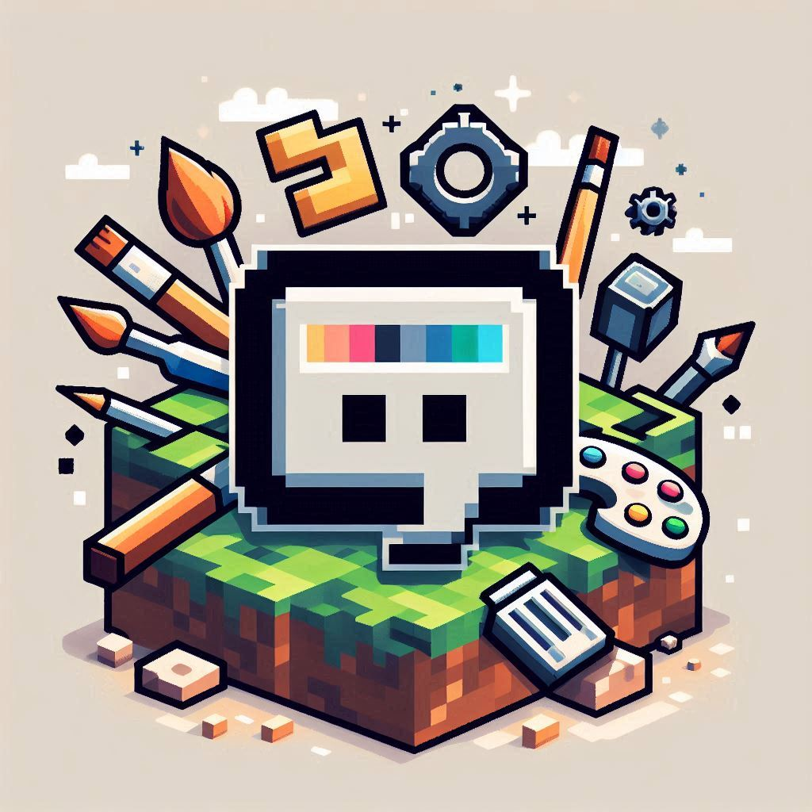

# EasyCustomizedChat


[](https://github.com/FabrizioCoder/EasyCustomizedChat/releases)
[](https://github.com/FabrizioCoder/EasyCustomizedChat/actions)
[](https://www.minecraft.net/)
[](https://fabricmc.net/)
[](https://opensource.org/licenses/MIT)
[](https://github.com/FabrizioCoder/EasyCustomizedChat/issues)
[](https://github.com/FabrizioCoder/EasyCustomizedChat/network/members)
[](https://github.com/FabrizioCoder/EasyCustomizedChat/stargazers)

## Description

EasyCustomizedChat is a Minecraft mod (Fabric) that allows you to easily customize your server's chat to your liking. With this mod, you can change the appearance of your chat, add custom colors, styles, and much more, making your server's communication more engaging and personalized.

## Features

- **Customizable Chat Colors**: Change the color of your chat messages to match your server's theme or your personal preference.
- **Stylish Text Options**: Apply different styles to your chat text, such as bold, italic, and underline.
- **Custom Chat Formats**: Create unique chat formats with various text alignments and arrangements.
- **User-Friendly Interface**: Intuitive and easy-to-use interface for quick customization.
- **Compatibility**: Fully compatible with the latest versions of Minecraft (Fabric).

## Installation

1. **Download and Install Fabric**:
    - Ensure you have Fabric installed. You can download it from [Fabric's official website](https://fabricmc.net/use/).

2. **Download EasyCustomizedChat**:
    - Download the latest version of EasyCustomizedChat from the [releases page](https://github.com/FabrizioCoder/EasyCustomizedChat/releases).

3. **Install the Mod**:
    - Place the downloaded `.jar` file into the `mods` folder of your Minecraft directory.

4. **Run Minecraft**:
    - Launch Minecraft with the Fabric profile. EasyCustomizedChat should now be installed and ready to use.

## Usage

Once installed, you can access the customization options through the in-game settings menu. Navigate to the chat settings, where you'll find various options to change chat colors, styles, and formats.

## Contributing

We welcome contributions to improve EasyCustomizedChat! Here’s how you can help:

1. **Fork the Repository**: Click the "Fork" button at the top right of this page.
2. **Clone Your Fork**: Clone your forked repository to your local machine.
   ```
   git clone https://github.com/yourusername/EasyCustomizedChat.git
   ```
3. **Create a Branch**: Create a new branch for your feature or bugfix.
   ```
   git checkout -b feature-name
   ```
4. **Make Your Changes**: Implement your changes and commit them with clear and concise messages.
   ```
   git commit -m "Add new feature"
   ```
5. **Push to Your Fork**: Push your changes to your forked repository.
   ```
   git push origin feature-name
   ```
6. **Submit a Pull Request**: Open a pull request on the original repository and describe your changes.

## License

This project is licensed under the MIT License. See the [LICENSE](LICENSE) file for details.

## Contact

For any questions, suggestions, or issues, please open an issue on the [GitHub repository](https://github.com/FabrizioCoder/EasyCustomizedChat/issues).

---

Thank you for using EasyCustomizedChat! We hope you enjoy customizing your Minecraft server's chat experience.